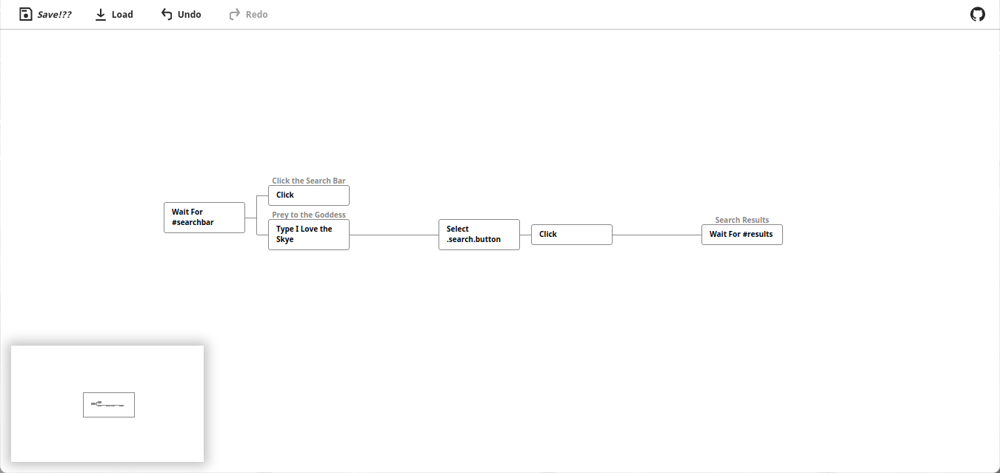
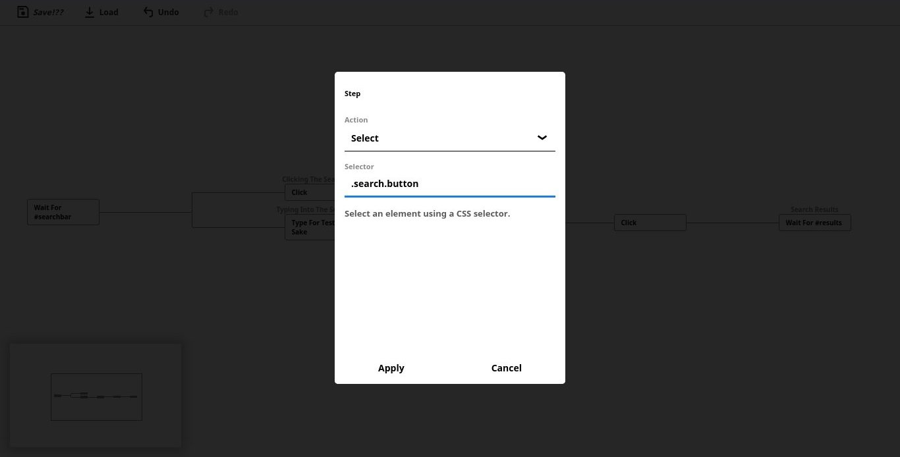

[](http://npmjs.com/package/might-ui)


**This project is still new, issues are to be expected.**

## The Problem

End-to-end testing can get very complicated and overwhelming; especially if you want to start testing a huge app, that would take a lot of time and afford, and will be boring and repetitive.

## The Solution

A no-code (almost zero-config) method to perform and manage end-to-end tests, handling most of the mess in the background.

Might is an easy way to create, manage, edit and run tests, it was designed to make the whole process easier and way faster.

## Installation

#### IMPORTANT: This project depends on the experimental [Native File System API](https://web.dev/native-file-system/) which is currently only supported by Chrome 83+ and requires ```chrome://flags/#native-file-system-api``` to be enabled manually.

`npm install --save-dev might-ui`

## Usage

`npx might-ui`
or `npx might -m` if you have might-cli installed.

After that it opens automatically in your browser, **(but to actually run the tests you need to install [might-cli](https://github.com/ItsKerolos/might-cli)).**

- [Waiting](https://github.com/ItsKerolos/Might/blob/master/src/documentation/wait.md)
- [Changing the Viewport](https://github.com/ItsKerolos/Might/blob/master/src/documentation/viewport.md)
- [Going to Different Pages](https://github.com/ItsKerolos/Might/blob/master/src/documentation/goto.md)
- [Setting Media Features](https://github.com/ItsKerolos/Might/blob/master/src/documentation/media.md)
- [Keypresses](https://github.com/ItsKerolos/Might/blob/master/src/documentation/click.md)
- [Hovering](https://github.com/ItsKerolos/Might/blob/master/src/documentation/hover.md)
- [Clicking](https://github.com/ItsKerolos/Might/blob/master/src/documentation/select.md)
- [Dragging Elements](https://github.com/ItsKerolos/Might/blob/master/src/documentation/drag.md)
- [Swiping the Screen](https://github.com/ItsKerolos/Might/blob/master/src/documentation/swipe.md)
- [Typing](https://github.com/ItsKerolos/Might/blob/master/src/documentation/keyboard.md)

[](https://github.com/ItsKerolos/Might/raw/master/screenshots/1.png)

[](https://github.com/ItsKerolos/Might/raw/master/screenshots/2.png)